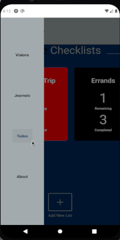

# Affirmation Taker

## Built With

- [React Native](https://reactnative.dev/)
- [TypeScript](https://www.typescriptlang.org/)
- [React Redux](https://react-redux.js.org/)

## Prerequisites

- [NodeJS](https://nodejs.org)
- [Expo](https://expo.io/)

## Usage

```bash
npm install
```

or

```bash
bash install
```

And then to run the project:

```bash
npm start
```

or

```bash
expo start
```

## About

A project that initially started as just a vision board, but expanded as my JavaScript knowledge grew. It now includes a dream journal and note taker/todo list combo.

## Demo

<table>
  <tr>
    <td>Visions Screen</td>
    <td>Dream Journal Screen</td>
    <td>Notes Screen</td>
  </tr>
  <tr>
    <td valign="top"></td>
    <td valign="top"></td>
    <td valign="top"></td>
  </tr>
 </table>

## Made with ❤️ by :

👤 **Ryan Paige**

- Twitter: [@universallyry](https://twitter.com/universallyry)
- Github Profile: [@universallyry](https://github.com/universallyry)

---

_This README was generated with ❤️ by [readme-md-generator](https://github.com/kefranabg/readme-md-generator)_
