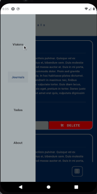

# Vision Board made with React Native

## Built With

- [React Native](https://reactnative.dev/)
- [ReactJS](https://reactjs.org)
- [React Redux](https://react-redux.js.org/)

## Prerequisites

- [NodeJS](https://nodejs.org)
- [Expo](https://expo.io/)

## Usage

```bash
expo install
```

or

```bash
npm install
```

And then to run the project:

```bash
expo start
```

or

```bash
npm start
```

## Demo

<table>
  <tr>
    <td>Visions Screen</td>
    <td>Dream Journal Screen</td>
    <td>Todos Screen</td>
  </tr>
  <tr>
    <td valign="top"></td>
    <td valign="top"></td>
    <td valign="top"></td>
  </tr>
 </table>
